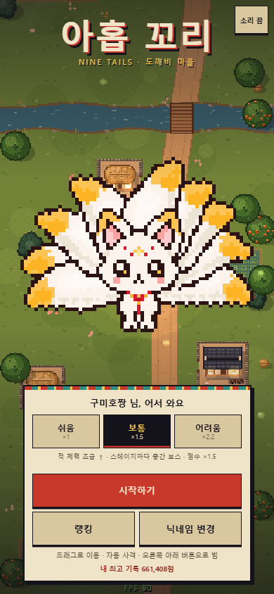
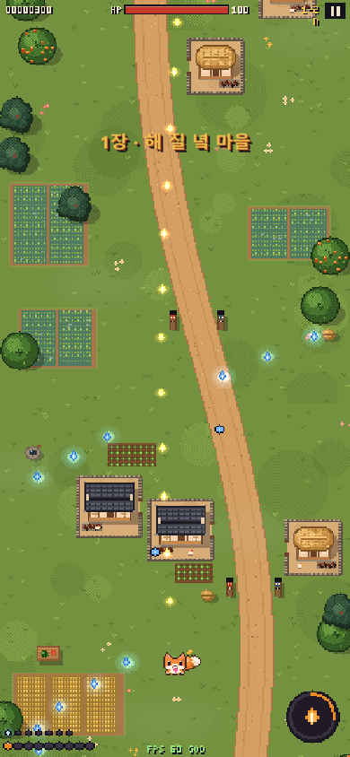
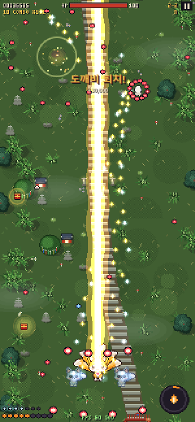
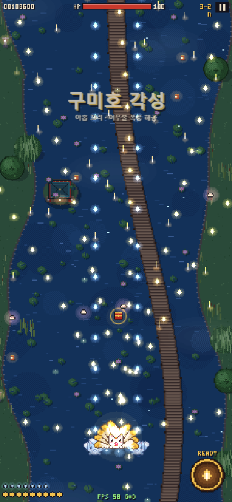
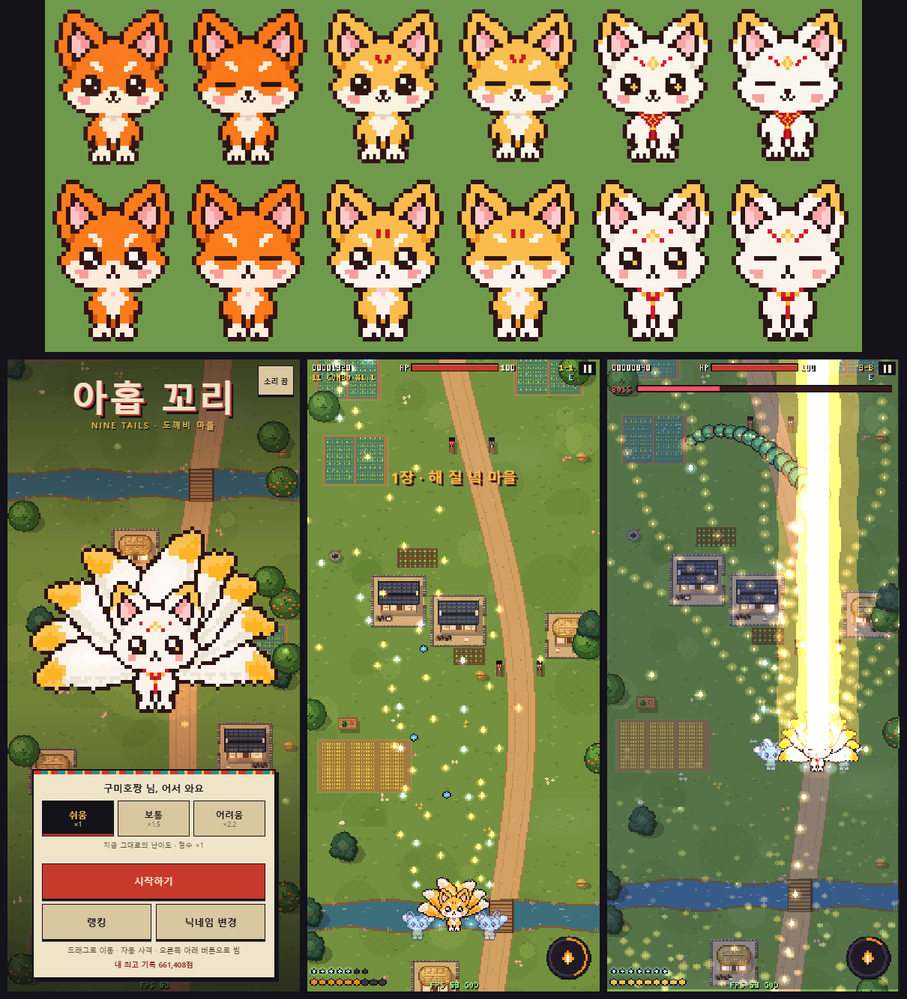
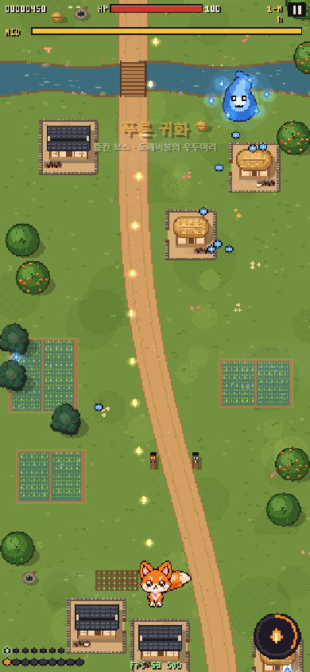
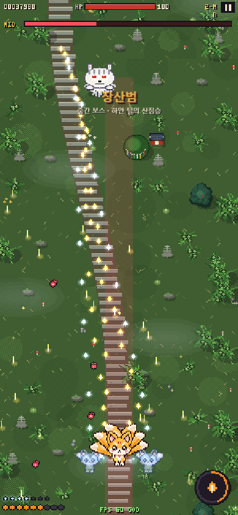
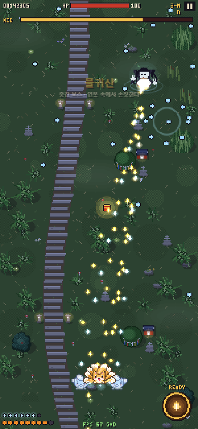

# 아홉 꼬리 — 도깨비 마을 슈팅

**▶ 바로 플레이: https://haneul-two.github.io/gumiho-shooter/** (휴대폰은 세로로)

꼬마 여우가 꼬리를 하나씩 늘려 구미호가 되어 가며 도깨비를 물리치는 고전풍 종스크롤 슈팅게임입니다.
`index.html` 한 파일로 되어 있고 외부 라이브러리·이미지·사운드 파일이 없습니다. 더블클릭하면 바로 실행되고, GitHub Pages에 그대로 올릴 수 있습니다.

| 타이틀 | 1장 마을 | 2장 대숲 산길 | 3장 달빛 연못 |
|---|---|---|---|
|  |  |  |  |

## 실행

- **PC**: `index.html` 더블클릭
- **휴대폰**: 위 링크로 접속 (세로 화면)
- 처음 실행하면 닉네임을 정합니다. 2~10자, 한글·영문·숫자만 됩니다. 닉네임은 기기에 저장되고, 타이틀의 "닉네임 변경"으로 바꿀 수 있습니다.
- 타이틀에서 **난이도(쉬움·보통·어려움)**를 고릅니다. 고른 난이도는 기기에 저장됩니다.

## 조작

| | 휴대폰 | PC |
|---|---|---|
| 이동 | 화면 아무 곳이나 드래그 (손가락이 움직인 만큼 따라 움직여서 캐릭터가 손가락에 가리지 않음) | 방향키 / WASD, Shift = 정밀 이동 |
| 사격 | 자동 | 자동 |
| 빔 | 오른쪽 아래 둥근 버튼, 게이지가 차면 금색 (설정에서 왼쪽으로 바꿀 수 있음) | X 또는 Space |
| 일시정지 | 오른쪽 위 ‖ 버튼 | P / Esc |

앱이 백그라운드로 가거나 창이 포커스를 잃으면 자동으로 일시정지합니다. 효과음과 배경음은 Web Audio로 합성합니다. 지원하는 기기에서는 피격·진화·보스 격파 때 진동합니다.

### 설정 (타이틀 · 일시정지 화면의 "설정")

| 항목 | 기본값 | 설명 |
|---|---|---|
| 효과음 | 80 | 0~100. 손을 떼면 효과음으로 크기를 들려줍니다 |
| 배경음 | 70 | 0~100. 손을 떼면 짧은 가락으로 크기를 들려줍니다 |
| 진동 | 켬 | 끄면 피격·진화 때 진동하지 않습니다 |
| 빔 버튼 | 오른쪽 | 왼쪽으로 바꾸면 꼬리·구슬 표시가 오른쪽 아래로 옮겨갑니다(왼손잡이용) |

설정은 기기에 저장됩니다. 소리 전체 켬/끔은 타이틀 오른쪽 위와 일시정지 화면의 "소리" 버튼으로 합니다.

## 캐릭터

정면을 보는 27×36px 꼬마 여우입니다. ChatGPT로 그린 원화(`art/*.png`, 폼 3종 × 눈 뜬/감은 것)를 픽셀 격자로 옮겼고, 좌우 대칭과 눈 하이라이트만 정리했습니다. 1px씩 통통 뛰며 3초마다 눈을 깜빡입니다. 꼬리는 게임이 따로 그려서 **머리 뒤로 부채처럼** 펼쳐지고, 꼬리가 늘수록 부채가 넓어져 9개가 되면 후광처럼 보입니다. 맞는 판정은 가슴의 작은 분홍 하트 한 점뿐입니다.



| 단계 | 모습 |
|---|---|
| 꼬리 1~4 | 주황 여우, 크림색 꼬리끝 |
| 꼬리 5~8 | 금빛 여우 + 이마의 붉은 무늬, 양옆에 파란 환영 여우(같은 캐릭터의 19×25 작은 버전) |
| 꼬리 9 | **구미호**: 흰 털, 금빛 귀와 꼬리끝, 이마 보석과 붉은 점, 눈 속 금빛 반짝임, 노리개 목걸이, 금빛 후광 |

## 성장 시스템

### 여우구슬 — 탄 개수 (1 → 7)

여우 주위를 도는 구슬마다 도깨비불이 나갑니다.

| 구슬 | 사격 |
|---|---|
| 1 | 단발 |
| 2 | 쌍발 |
| 3 | 부채꼴 |
| 4 | 넓은 부채꼴 |
| 5 | 다섯 갈래 |
| 6 | 다섯 갈래 + 후방 |
| 7 | 전방위 (앞 5 · 양옆 2 · 뒤 1) |

### 진화 상자 — 꼬리 (1 → 9)

| 꼬리 | 변화 |
|---|---|
| 1 | 기본 도깨비불 |
| 2 | 도깨비불이 적을 따라감 (유도) |
| 3 | 여우불 폭발: 명중하면 주변까지 터짐 |
| 4 | 빔 1차 강화: 굵어지고 관통 |
| 5 | 환영 여우 2마리가 양옆에서 함께 사격 · 금빛 여우로 변신 |
| 6 | 여우비: 7초마다 불비가 내려 적 탄을 지움 |
| 7 | 빔 2차 강화: 세 줄기로 갈라지고 적 탄을 지움 |
| 8 | 꼬리 휘두르기: 가까이 온 적을 베고 적 탄을 되받아침 |
| 9 | **구미호 각성**: 변신 연출 중 무적, 화면의 적 탄 소거, 공격력 ×1.5, 연사 증가, 빔이 **여우불 폭풍**(화면 전체 공격 + 아홉 갈래 불줄기, 폭풍 중 무적)으로 바뀜 |

- **빔 게이지**는 적을 맞히거나 처치하면 차고, 시간이 지나도 조금씩 찹니다. 가득 차면 버튼을 눌러 2.5초(폭풍은 3.5초) 동안 쏩니다. 빔 소리는 맑은 종소리와 부드러운 바람 소리입니다.
- 아이템은 **평범하게 플레이해도 마지막 보스 전에 꼬리 9·구슬 7**이 되도록 배치했습니다. 놓치면 4초 뒤 다시 떨어집니다.
- 다 채운 뒤 진화 상자를 먹으면 +5,000점, 구슬을 먹으면 +3,000점입니다(난이도 배율 적용).

## 난이도

| | 쉬움 | 보통 | 어려움 |
|---|---|---|---|
| **내 체력** | **100** | **80** | **60** |
| 적 체력 | ×1 | ×1.25 | ×1.6 |
| 보스·중간 보스 체력 | ×1 | ×1.2 | ×1.5 |
| 중간 보스 | 없음 | 스테이지마다 1마리 | 스테이지마다 1마리 |
| 보스 | 기본 패턴 | 기본 패턴 | 패턴 간격 20% 짧음, 탄 수 증가, **전용 패턴 1개씩 추가** |
| 적 공격 | 기본 | 기본 | 휘는 탄, 가속 탄, 쌀알 탄, **쓰러질 때 반격탄** |
| 적 탄 속도 | ×1 | ×1 | ×1.12 |
| **점수 배율** | **×1** | **×1.5** | **×2.2** |

- **쉬움**은 첫 버전과 같은 난이도입니다.
- 어려움 적의 변화: 푸른 도깨비불 3갈래, 꼬마 도깨비 방망이와 함께 원형탄, 달걀귀신 휘는 이중 고리와 조준탄, 어둑시니 휘는 큰 탄 부채, 불가사리 7갈래와 가속 큰 탄. 반격탄은 여우 바로 앞(60px 이내)에서는 나오지 않습니다.
- 어려움 보스 전용 패턴: 외눈 도깨비 대장 '휘어 도는 삼중 나선', 두억시니 '두 손 동시 내려치기(여우 좌우를 막음)', 이무기 '마디마다 휘도는 물살'.
- 점수 배율은 적 처치, 보스 보너스, 탄 소거, 클리어 보너스 등 모든 점수에 적용됩니다.

## 체력과 게임오버

| 항목 | 쉬움 | 보통 | 어려움 |
|---|---|---|---|
| 최대 체력 | 100 | 80 | 60 |
| 적 탄에 맞음 | −10 | −10 | −10 |
| 적·보스와 부딪힘, 두억시니 손에 깔림, 장산범에 덮쳐짐 | −20 | −20 | −20 |
| 여우 떡 (최대 체력의 20%, 가끔 떨어짐 · 불가사리·중간 보스는 반드시) | +20 | +16 | +12 |
| 스테이지 클리어 (최대 체력의 30%) | +30 | +24 | +18 |
| 저체력 경고 (최대 체력의 30% 이하, 체력바 깜빡임 · 화면 가장자리 붉게) | 30 | 24 | 18 |

맞은 뒤에는 1초 동안 무적입니다(깜빡임 · 화면 가장자리 붉게 · 진동).

- 맞아도 꼬리와 구슬은 줄지 않습니다. 한 판 안에서 스킬을 전부 맛보게 하려는 설계입니다.
- 체력이 0이 되면 게임오버 화면으로 넘어갑니다. 점수, 난이도, 도달 스테이지, 꼬리 수, 최대 콤보, 플레이 시간, 이번 순위와 다시하기/랭킹/처음으로 버튼이 나옵니다.
- 마지막 보스를 쓰러뜨리면 클리어이고, **남은 체력 × 100**을 보너스 점수로 받습니다.

## 점수

- 적 처치 점수 × 콤보 배율 (1.8초 안에 연속 처치하면 콤보, 10콤보마다 ×0.1씩 올라 최대 ×3.0)
- 보스 격파 보너스: 1장 20,000 / 2장 40,000 / 3장 80,000
- 중간 보스 격파 보너스: 1장 5,000 / 2장 10,000 / 3장 15,000
- 적 탄을 지우면 탄당 10점
- 위의 모든 점수에 난이도 배율(×1 / ×1.5 / ×2.2) 적용

## 스테이지 (장소가 모두 다릅니다)

스테이지마다 약 3분 뒤에 WARNING과 함께 보스가 나옵니다. 새 장소는 화면 위쪽 밖에서부터 이어지고, 경계에는 1→2장 **홍살문과 돌담**, 2→3장 **돌 축대**가 있습니다.

| 장소 | 풍경 | 보스 |
|---|---|---|
| 1장 해 질 녘 마을 | 흙길, 초가집·기와집, 돌담과 장독대, 마당의 닭, 황금 논과 배추밭, 개울과 나무다리, 장승, 평상 위 수박, 볏가리, 감나무 | 외눈 도깨비 대장 |
| 2장 대숲 산길 | 돌계단 길, 대나무 포기, 떨어진 댓잎, 서낭당(신목·금줄·오색천·돌무더기·당집), 돌탑, 석등, 이끼 바위, 버섯, 계곡과 나무다리 | 두억시니 |
| 3장 달빛 연못 | 연못 위 나무 데크 길, 연잎과 연꽃, 정자가 있는 섬, 갈대와 부들, 버드나무, 기슭의 석등, 물 위 연등, 반짝이는 물결 | 이무기 |

빛깔도 장소마다 다릅니다(마을 = 노을빛, 대숲 = 푸른 저녁, 연못 = 달밤). 불빛(창문·석등·연등)은 저녁 이후에 켜지고, 2·3장에는 반딧불이 날아다닙니다.

### 적

| 적 | 특징 |
|---|---|
| 푸른 도깨비불 | 무리 지어 물결치며 내려옴. 가끔 조준탄 |
| 꼬마 도깨비 (1장 빨강 · 2장 파랑 · 3장 초록) | 내려와 멈춘 뒤 방망이를 던짐 (3장은 3갈래) |
| 달걀귀신 | 얼굴 없는 귀신. 사라졌다 나타나며(투명할 땐 무적) 나타날 때 원형 탄막 |
| 어둑시니 | **바라보면 커지고 외면하면 작아짐.** 여우가 정면 아래에 있으면 커지면서 탄이 늘어남 |
| 불가사리 | 쇠를 먹는 괴물. 단단해서 도깨비불 피해 50% (빔은 온전히 들어감) |

### 중간 보스 (보통·어려움)

84초에 등장합니다. 살아 있는 동안에는 스테이지 시간이 멈추고, 35초가 지나면 물러납니다. 쓰러뜨리면 여우 떡과 빔 게이지 +40을 줍니다.

| | 중간 보스 | 패턴 |
|---|---|---|
| 1장 | 푸른 귀화 (도깨비불의 우두머리) | 주위를 도는 도깨비불 6개가 차례로 사격 · 원형탄 · 쌍나선 |
| 2장 | 장산범 (하얀 털의 산짐승) | 할퀴기 부채탄 · 붉은 기둥 예고 뒤 **아래로 덮치기** · 크고 느린 울음 탄 |
| 3장 | 물귀신 (연못 속에서 손짓한다) | 물결이 이는 곳에서 원형탄 · 휘어 오는 머리카락 탄 · 조준 연사 |

| 푸른 귀화 | 장산범 | 물귀신 |
|---|---|---|
|  |  |  |

### 보스

| 보스 | 패턴 |
|---|---|
| 1장 외눈 도깨비 대장 | 조준 부채탄 · 회전 원형탄 · 방망이 투척 · 도깨비불 소환. 외눈이 여우를 따라 봄 |
| 2장 두억시니 | 거대한 손 내려치기(붉은 기둥으로 예고 → 착지 충격파) · 나선탄 · 탄 비 · 조준탄 |
| 3장 이무기 | 몸통 14마디가 차례로 사격 · 꽃잎 나선 · 예고선 뒤 물줄기 브레스 · 마디별 원형탄 |

보스는 체력이 절반 아래로 떨어지면 붉게 번쩍이며 2페이즈로 들어가고, 패턴이 빨라지고 촘촘해집니다.

## 온라인 랭킹 설정 (Supabase)

**지금 배포본은 온라인 랭킹이 켜져 있습니다.** 공개 키는 원래 브라우저에 노출되도록 만든 키이고, 보안은 아래 SQL의 규칙(조회·추가만 허용, 수정·삭제 불가)이 지킵니다. 설정을 비우면 **같은 기기 안에서만 겨루는 오프라인 랭킹**으로 동작합니다. 다른 기기의 플레이어끼리 겨루려면 아래 순서대로 공용 저장소를 만드세요.

1. [supabase.com](https://supabase.com)에서 무료 프로젝트를 만듭니다.
2. 왼쪽 메뉴 **SQL Editor**에서 아래 SQL을 실행합니다.
3. **Project Settings → API**(또는 Data API · API Keys)에서 `Project URL`과 공개 키(`anon public`의 `eyJ…` 또는 `sb_publishable_…`)를 복사합니다. `service_role`·`secret` 키는 관리자용이라 절대 넣으면 안 됩니다.
4. `index.html` 맨 위의 `window.GUMIHO_CONFIG`에 두 값을 넣습니다.

```js
window.GUMIHO_CONFIG = {
  SUPABASE_URL: 'https://abcd1234.supabase.co',
  SUPABASE_ANON_KEY: 'eyJhbGciOi...'
};
```

```sql
-- 기록 테이블
create table public.scores (
  id            uuid primary key,                -- 게임이 기록마다 만든 고유 id (재전송해도 중복 저장 안 됨)
  nickname      text not null check (char_length(nickname) between 2 and 10),
  score         integer not null check (score between 0 and 10000000),
  max_tail      smallint not null check (max_tail between 1 and 9),
  stage         smallint not null check (stage between 1 and 3),
  clear_time_ms integer check (clear_time_ms is null or clear_time_ms between 0 and 7200000),
  difficulty    text not null default 'easy' check (difficulty in ('easy','normal','hard')),
  created_at    timestamptz not null default now()
);

-- 누구나 조회·추가만 가능, 수정·삭제는 막음
alter table public.scores enable row level security;
create policy "scores_read"   on public.scores for select to anon using (true);
create policy "scores_insert" on public.scores for insert to anon with check (true);
grant select, insert on public.scores to anon;
-- update / delete 정책은 만들지 않음 → RLS가 막음

-- 닉네임마다 최고 기록 1개만 보여 주는 랭킹 뷰
create view public.leaderboard with (security_invoker = true) as
select distinct on (nickname) nickname, score, max_tail, stage, clear_time_ms, difficulty, created_at
from public.scores
order by nickname, score desc, created_at asc;

grant select on public.leaderboard to anon;
```

### 랭킹 동작

- 랭킹은 **난이도를 합친 하나의 순위표**입니다. 어려운 난이도일수록 점수 배율이 높아서 순위에 유리하고, 기록마다 난이도(쉬움·보통·어려움) 표시가 붙습니다.
- **게임오버·클리어** 때 기록을 제출하고 "이번 기록 N위"를 보여 줍니다. 순위는 다른 플레이어의 최고 기록과 비교해서 계산하고, 내 최고 기록 순위도 함께 표시합니다.
- **랭킹 화면**은 TOP 20을 보여 줍니다. 닉네임마다 최고 기록 하나만 나오고, 내 기록은 금색으로 강조됩니다. 내가 20위 밖이면 맨 아래 `⋯` 다음에 내 순위가 따로 나옵니다. 3장까지 완주한 기록에는 "완주" 표시가 붙습니다.
- **네트워크가 실패해도 게임은 멈추지 않습니다.** 이때는 이 기기의 로컬 랭킹으로 대체하고 "오프라인 랭킹"이라고 표시합니다.
- 제출에 실패한 기록은 기기에 보관했다가 다음 접속 때나 네트워크가 돌아왔을 때 다시 보냅니다. 기록마다 고유 id가 있어서, 서버가 이미 받은 기록을 다시 보내도(409) 성공으로 처리하고 중복 저장되지 않습니다.
- 서버에 최대 1,000명까지 불러와 순위를 계산합니다. 그보다 참가자가 많으면 1,000위 밖 순위는 정확하지 않습니다.

### 한계 — 점수 조작

점수는 브라우저가 계산해서 보냅니다. 마음먹으면 개발자 도구로 조작한 점수를 올릴 수 있습니다. check 제약으로 말이 안 되는 값(음수, 1천만 점 초과, 꼬리 10개 등)만 막습니다. `?debug=1`(무적·보스 소환 가능)로 한 판은 로컬·온라인 어디에도 기록하지 않습니다. 친구끼리 겨루는 용도로는 충분하지만, 공개 대회라면 서버 쪽 검증이 따로 필요합니다.

Supabase 무료 프로젝트는 한동안 요청이 없으면 일시정지될 수 있습니다. 그동안에는 오프라인 랭킹으로 대체됩니다.

## 디버그 모드

주소 뒤에 `?debug=1`을 붙이면 켜집니다. 화면 아래에 fps가 표시되고, 게임 중에 다음 키를 쓸 수 있습니다. 디버그 모드로 한 판은 랭킹에 기록되지 않습니다.

| 키 | 기능 |
|---|---|
| 1 ~ 9 | 꼬리 단계 바로 설정 (9는 각성 연출 포함) |
| O | 여우구슬 +1 |
| B | 빔 게이지 가득 채우기 |
| M | 현재 스테이지 중간 보스 소환 |
| N | 보스가 없으면 현재 스테이지 보스 소환, 있으면 즉시 격파 (→ 다음 스테이지) |
| H | 체력 −30 |
| K | 즉시 게임오버 |
| G | 무적 모드 켜기/끄기 (화면에 GOD 표시) |

`window.__g`로 게임 상태에 접근할 수 있습니다(테스트용). `__g.sheet(true)`는 폼별 여우를 크게 늘어놓은 캐릭터 시트를 보여 줍니다.

## 기술 메모

- 내부 해상도는 가로 240px이고, 세로는 화면 비율에 맞춰 400~520px입니다. 기기 픽셀 기준 정수배로 확대하고, 정수배가 화면을 85% 미만으로 채우면 꽉 채우기로 전환합니다.
- 픽셀아트는 모두 코드(문자열 스프라이트 + 픽셀 원·타원·디더링)로 그립니다. 장소 3종은 256px 높이 청크 단위로 절차 생성하고, 3겹 parallax(땅 · 나무 · 안개)로 스크롤합니다. 나무 층도 장소마다 다릅니다(마을 = 활엽수·감나무·소나무, 대숲 = 대나무, 연못 = 버드나무·갈대).
- 꼬리는 픽셀 원을 이어 그리고, 바깥 꼬리부터 한 개씩 외곽선·기본색·그늘·하이라이트 순으로 그려 꼬리마다 경계가 보이게 합니다.
- 연출: additive 발광, 파티클, 화면 흔들림, 히트스톱, 피격 번쩍임, 충격파 링, 슬로모션(진화), 빔 발사 중 화면 색조
- 탄·파티클은 object pool로 재사용합니다. 갱신은 고정 60Hz로 돌립니다.

## 검증 기록

Playwright(Chromium)로 확인했습니다. 스크린샷은 `shots/`에 있습니다.

| 항목 | 결과 |
|---|---|
| 콘솔 에러 | 모바일 390×844(터치 에뮬레이션)에서 쉬움·보통·어려움 전체 진행 중 0건 |
| 전체 진행 | 자동 플레이 봇(무적)으로 세 난이도 모두 클리어. 쉬움 588초, 보통 624초(중간 보스 3마리 등장·격파), 어려움 643초 |
| 성장 | 쉬움 기준 3장 보스 전에 꼬리 9·구슬 7 도달. 진화 경로로 꼬리 4·7·9에서 빔 1·2·3단계 확인 |
| 난이도 | 보통: 중간 보스가 84초에 체력 ×1.2로 등장하고 살아 있는 동안 스테이지 시간 정지. 어려움: 보스 체력 ×1.5, 전용 패턴 추가, 휘는·가속·반격탄 발생(쉬움에서는 없음) |
| 장소 | 1·2·3장 풍경과 두 경계(홍살문, 돌 축대) 촬영 |
| 빔 소리 | 예전·새 지속음을 오프라인 합성해 비교: 크기 RMS 0.060 → 0.015, 최대값 0.141 → 0.037 (약 1/4) |
| fps | CPU 4배 스로틀(중급 폰 근사)에서 3장 보스전 60, 여우불 폭풍 중 54~55 |
| 랭킹 | 결과 화면에 난이도·배율, 랭킹 목록에 난이도 표시 (`result-normal.png`, `rank-difficulty.png`) |

실제 휴대폰에서의 소리 크기와 느낌은 직접 들어 보셔야 합니다.
