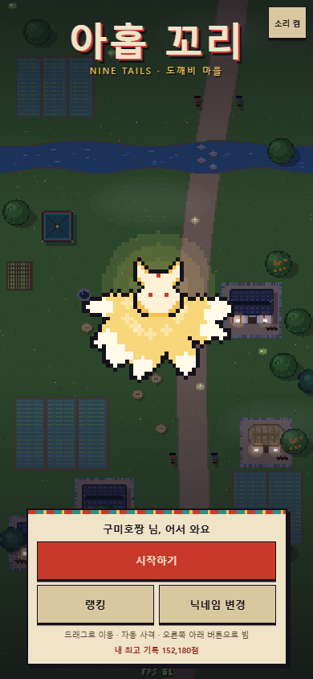

# 아홉 꼬리 — 도깨비 마을 슈팅

**▶ 바로 플레이: https://haneul-two.github.io/gumiho-shooter/** (휴대폰은 세로로)

구미호가 되어 가는 여우로 도깨비를 물리치는 고전풍 종스크롤 슈팅게임입니다.
`index.html` 한 파일로 되어 있고 외부 라이브러리·이미지·사운드 파일이 없습니다. 더블클릭하면 바로 실행되고, GitHub Pages에 그대로 올릴 수 있습니다.



## 실행

- **PC**: `index.html` 더블클릭
- **휴대폰**: GitHub Pages 같은 곳에 올린 뒤 주소로 접속 (세로 화면)
- 처음 실행하면 닉네임을 정합니다. 2~10자, 한글·영문·숫자만 됩니다. 닉네임은 기기에 저장되고, 타이틀의 "닉네임 변경"으로 바꿀 수 있습니다.

## 조작

| | 휴대폰 | PC |
|---|---|---|
| 이동 | 화면 아무 곳이나 드래그 (손가락이 움직인 만큼 따라 움직여서 캐릭터가 손가락에 가리지 않음) | 방향키 / WASD, Shift = 정밀 이동 |
| 사격 | 자동 | 자동 |
| 빔 | 오른쪽 아래 둥근 버튼 (게이지가 차면 금색) | X 또는 Space |
| 일시정지 | 오른쪽 위 ‖ 버튼 | P / Esc |

앱이 백그라운드로 가거나 창이 포커스를 잃으면 자동으로 일시정지합니다. 효과음과 배경음은 Web Audio로 합성하며, 소리 켬/끔 설정은 저장됩니다. 지원하는 기기에서는 피격·진화·보스 격파 때 진동합니다.

## 성장 시스템

성장 축은 두 가지이고, 둘 다 단계마다 눈에 띄게 달라지도록 만들었습니다.

### 여우구슬 — 탄 개수 (1 → 7)

여우 주위를 도는 구슬마다 도깨비불이 나갑니다.

| 구슬 | 사격 |
|---|---|
| 1 | 단발 |
| 2 | 쌍발 |
| 3 | 부채꼴 |
| 4 | 넓은 부채꼴 |
| 5 | 다섯 갈래 |
| 6 | 다섯 갈래 + 후방 |
| 7 | 전방위 (앞 5 · 양옆 2 · 뒤 1) |

### 진화 상자 — 꼬리 (1 → 9)

| 꼬리 | 변화 |
|---|---|
| 1 | 기본 도깨비불 |
| 2 | 도깨비불이 적을 따라감 (유도) |
| 3 | 여우불 폭발: 명중하면 주변까지 터짐 |
| 4 | 빔 1차 강화: 굵어지고 관통 |
| 5 | 환영 여우 2마리가 양옆에서 함께 사격 · 털이 금빛으로 바뀜 |
| 6 | 여우비: 7초마다 불비가 내려 적 탄을 지움 |
| 7 | 빔 2차 강화: 세 줄기로 갈라지고 적 탄을 지움 |
| 8 | 꼬리 휘두르기: 가까이 온 적을 베고 적 탄을 되받아침 |
| 9 | **구미호 각성**: 흰·금빛 구미호로 변신(변신 연출 중 무적, 화면의 적 탄 소거), 공격력 ×1.5, 연사 증가, 빔이 **여우불 폭풍**(화면 전체 공격 + 아홉 갈래 불줄기, 폭풍 중 무적)으로 바뀜 |

- **빔 게이지**는 적을 맞히거나 처치하면 차고, 시간이 지나도 조금씩 찹니다. 가득 차면 버튼을 눌러 2.5초(폭풍은 3.5초) 동안 쏩니다.
- 아이템은 **평범하게 플레이해도 마지막 보스 전에 꼬리 9·구슬 7**이 되도록 배치했습니다. 놓치면 4초 뒤 다시 떨어집니다. 아이템만 따라가는 자동 플레이 시뮬레이션에서 1장 보스 전 꼬리 4·구슬 3, 2장 보스 전 꼬리 7·구슬 5, 3장 보스 전 꼬리 9·구슬 7을 확인했습니다.
- 다 채운 뒤 진화 상자를 먹으면 +5,000점, 구슬을 먹으면 +3,000점입니다.

## 체력과 게임오버

| 항목 | 값 |
|---|---|
| 최대 체력 | 100 |
| 적 탄에 맞음 | −10 |
| 적·보스와 부딪힘, 두억시니 손에 깔림 | −20 |
| 맞은 뒤 무적 | 1초 (깜빡임 · 화면 가장자리 붉게 · 진동) |
| 여우 떡 (가끔 떨어짐, 불가사리는 반드시 떨어뜨림) | +20 |
| 스테이지 클리어 | +30 |

- 맞아도 꼬리와 구슬은 줄지 않습니다. 한 판 안에서 스킬을 전부 맛보게 하려는 설계입니다.
- 맞으면 콤보가 끊기고, 주변의 적 탄이 조금 지워집니다.
- 체력이 0이 되면 쓰러지는 연출 뒤 게임오버 화면으로 넘어갑니다. 게임오버 화면에는 점수, 도달 스테이지, 꼬리 수, 최대 콤보, 플레이 시간, 이번 순위와 다시하기/랭킹/처음으로 버튼이 나옵니다.
- 마지막 보스를 쓰러뜨리면 클리어이고, **남은 체력 × 100**을 보너스 점수로 받습니다.

## 점수

- 적 처치 점수 × 콤보 배율 (1.8초 안에 연속 처치하면 콤보, 10콤보마다 ×0.1씩 올라 최대 ×3.0)
- 보스 격파 보너스: 1장 20,000 / 2장 40,000 / 3장 80,000
- 적 탄을 지우면 탄당 10점
- 클리어하면 남은 체력 보너스

## 적과 스테이지

스테이지는 3개이고, 각 약 3분 뒤에 WARNING과 함께 보스가 나옵니다. 스테이지가 진행될수록 해 질 녘에서 밤으로 바뀌고, 밤에는 집 창문에 불이 켜지고 반딧불이 날아다닙니다.

| 적 | 특징 |
|---|---|
| 푸른 도깨비불 | 무리 지어 물결치며 내려옴. 가끔 조준탄 |
| 꼬마 도깨비 (1장 빨강 · 2장 파랑 · 3장 초록) | 내려와 멈춘 뒤 방망이를 던짐 (3장은 3갈래) |
| 달걀귀신 | 얼굴 없는 귀신. 사라졌다 나타나며(투명할 땐 무적) 나타날 때 원형 탄막 |
| 어둑시니 | **바라보면 커지고 외면하면 작아짐.** 여우가 정면 아래에 있으면 커지면서 탄이 늘어남 (민담 속 성질을 규칙으로 옮김) |
| 불가사리 | 쇠를 먹는 괴물. 단단해서 도깨비불 피해 50% (빔은 온전히 들어감) |

| 보스 | 패턴 |
|---|---|
| 1장 외눈 도깨비 대장 | 조준 부채탄 · 회전 원형탄 · 방망이 투척 · 도깨비불 소환. 외눈이 여우를 따라 봄 |
| 2장 두억시니 | 거대한 손 내려치기(붉은 기둥으로 예고 → 착지 충격파) · 나선탄 · 탄 비 · 조준탄 |
| 3장 이무기 | 몸통 14마디가 차례로 사격 · 꽃잎 나선 · 예고선 뒤 물줄기 브레스 · 마디별 원형탄 |

보스는 체력이 절반 아래로 떨어지면 붉게 번쩍이며 2페이즈로 들어가고, 패턴이 빨라지고 촘촘해집니다.

## 온라인 랭킹 설정 (Supabase)

설정하지 않으면 **같은 기기 안에서만 겨루는 오프라인 랭킹**으로 동작합니다. 다른 기기의 플레이어끼리 겨루려면 아래 순서대로 공용 저장소를 만드세요.

1. [supabase.com](https://supabase.com)에서 무료 프로젝트를 만듭니다.
2. 왼쪽 메뉴 **SQL Editor**에서 아래 SQL을 실행합니다.
3. **Project Settings → API**에서 `Project URL`과 `anon public` 키를 복사합니다.
4. `index.html` 맨 위의 `window.GUMIHO_CONFIG`에 두 값을 넣습니다.

```js
window.GUMIHO_CONFIG = {
  SUPABASE_URL: 'https://abcd1234.supabase.co',
  SUPABASE_ANON_KEY: 'eyJhbGciOi...'
};
```

```sql
-- 기록 테이블
create table public.scores (
  id            uuid primary key,                -- 게임이 기록마다 만든 고유 id (재전송해도 중복 저장 안 됨)
  nickname      text not null check (char_length(nickname) between 2 and 10),
  score         integer not null check (score between 0 and 10000000),
  max_tail      smallint not null check (max_tail between 1 and 9),
  stage         smallint not null check (stage between 1 and 3),
  clear_time_ms integer check (clear_time_ms is null or clear_time_ms between 0 and 7200000),
  created_at    timestamptz not null default now()
);

-- 누구나 조회·추가만 가능, 수정·삭제는 막음
alter table public.scores enable row level security;
create policy "scores_read"   on public.scores for select to anon using (true);
create policy "scores_insert" on public.scores for insert to anon with check (true);
-- update / delete 정책은 만들지 않음 → RLS가 막음

-- 닉네임마다 최고 기록 1개만 보여 주는 랭킹 뷰
create view public.leaderboard with (security_invoker = true) as
select distinct on (nickname) nickname, score, max_tail, stage, clear_time_ms, created_at
from public.scores
order by nickname, score desc, created_at asc;

grant select on public.leaderboard to anon;
```

### 랭킹 동작

- **게임오버·클리어** 때 기록을 제출하고 "이번 기록 N위"를 보여 줍니다. 순위는 다른 플레이어의 최고 기록과 비교해서 계산하고, 내 최고 기록 순위도 함께 표시합니다.
- **랭킹 화면**은 TOP 20을 보여 줍니다. 닉네임마다 최고 기록 하나만 나오고, 내 기록은 금색으로 강조됩니다. 내가 20위 밖이면 맨 아래 `⋯` 다음에 내 순위가 따로 나옵니다. 3장까지 완주한 기록에는 "완주" 표시가 붙습니다.
- **네트워크가 실패해도 게임은 멈추지 않습니다.** 이때는 이 기기의 로컬 랭킹으로 대체하고 "오프라인 랭킹"이라고 표시합니다.
- 제출에 실패한 기록은 기기에 보관했다가 다음 접속 때나 네트워크가 돌아왔을 때 다시 보냅니다. 기록마다 고유 id가 있어서, 서버가 이미 받은 기록을 다시 보내도(409) 성공으로 처리하고 중복 저장되지 않습니다.
- 서버에 최대 1,000명까지 불러와 순위를 계산합니다. 그보다 참가자가 많으면 1,000위 밖 순위는 정확하지 않습니다.

### 한계 — 점수 조작

점수는 브라우저가 계산해서 보냅니다. 마음먹으면 개발자 도구로 조작한 점수를 올릴 수 있습니다. check 제약으로 말이 안 되는 값(음수, 1천만 점 초과, 꼬리 10개 등)만 막습니다. 친구끼리 겨루는 용도로는 충분하지만, 공개 대회라면 서버 쪽 검증(예: Edge Function에서 플레이 로그 검사)이 따로 필요합니다. 이번 범위에는 넣지 않았습니다.

Supabase 무료 프로젝트는 한동안 요청이 없으면 일시정지될 수 있습니다. 그동안에는 오프라인 랭킹으로 대체됩니다.

## 디버그 모드

주소 뒤에 `?debug=1`을 붙이면 켜집니다. 화면 아래에 fps가 표시되고, 게임 중에 다음 키를 쓸 수 있습니다.

| 키 | 기능 |
|---|---|
| 1 ~ 9 | 꼬리 단계 바로 설정 (9는 각성 연출 포함) |
| O | 여우구슬 +1 |
| B | 빔 게이지 가득 채우기 |
| N | 보스가 없으면 현재 스테이지 보스 소환, 있으면 즉시 격파 (→ 다음 스테이지) |
| H | 체력 −30 |
| K | 즉시 게임오버 |
| G | 무적 모드 켜기/끄기 (화면에 GOD 표시) |

`window.__g`로 게임 상태에 접근할 수 있습니다(테스트용).

## 기술 메모

- 내부 해상도는 가로 240px이고, 세로는 화면 비율에 맞춰 400~520px입니다. 기기 픽셀 기준 정수배로 확대하고, 정수배가 화면을 85% 미만으로 채우면 꽉 채우기로 전환합니다.
- 픽셀아트는 모두 코드(문자열 스프라이트 + 픽셀 원·타원)로 그립니다. 마을 배경(초가집·기와집·돌담·장독대·논·개울·징검다리·장승·정자·우물)은 절차적으로 생성하고, 3겹 parallax(땅 · 나무 · 안개)로 스크롤합니다.
- 연출: additive 발광, 파티클, 화면 흔들림, 히트스톱, 피격 번쩍임, 충격파 링, 슬로모션(진화), 빔 발사 중 화면 색조
- 탄·파티클은 object pool로 재사용합니다. 갱신은 고정 60Hz로 돌립니다.
- 색감은 먹색 · 한지색 · 쪽빛 · 단청 주홍/청록 · 도깨비불 주황을 씁니다.

## 검증 기록

Playwright(Chromium)로 확인했습니다. 스크린샷은 `shots/`에 있습니다.

| 항목 | 결과 |
|---|---|
| 콘솔 에러 | 데스크톱 1280×800, 모바일 390×844(터치 에뮬레이션), 디버그 없는 일반 모드에서 모두 0건 |
| 성장 단계 | 꼬리 1·5·9, 구슬 4·7, 빔 3단계·폭풍 화면 촬영 (`03`~`07`, `14`, `24`, `25`) |
| 보스 | 3종 모두 등장·격파 → 다음 스테이지 → 클리어 흐름 확인 (`10`, `11`, `13`) |
| 모바일 조작 | 드래그 이동(손가락 90px → 캐릭터 약 64 논리px), 드래그를 유지한 채 두 번째 손가락으로 빔 버튼 |
| fps | 60 유지. CPU 4배 스로틀(중급 폰 근사)에서 3장 보스전 60, 여우불 폭풍 중 55~57 |
| 닉네임 | 첫 실행 입력 화면, 규칙 위반 거부(짧음·특수문자·금칙어), 재실행하면 건너뜀 |
| 체력 | 피격 −10, 무적 중 추가 피격 무시, 0이면 게임오버, 다시하기로 새 판 (`15`, `16`) |
| 랭킹 | Supabase 모의 서버로 온라인 제출·TOP 20·20위 밖 표시, 실패 후 재전송·응답 유실 후 재전송 중복 없음, 서버 다운 시 오프라인 전환 (`17`, `18`) |

실제 휴대폰 기기에서는 아직 테스트하지 않았습니다.
